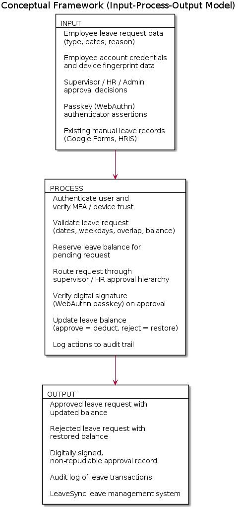
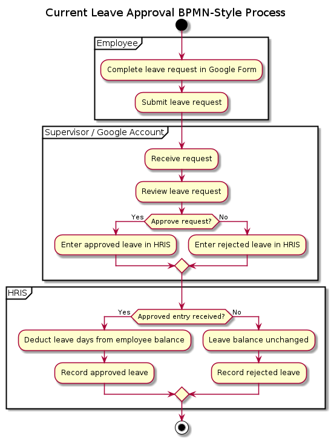
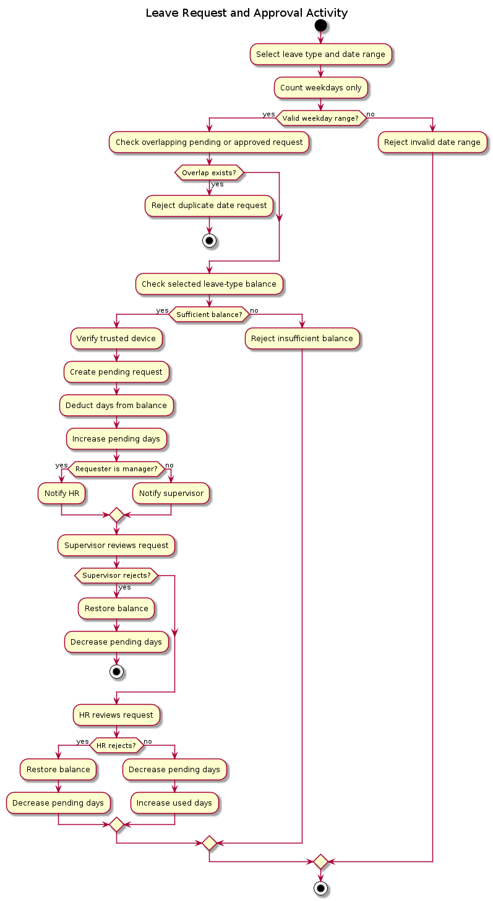

# LeaveSync: A Leave Management System with Device Fingerprinting and Digital Signature-Based Approval for The Lewis College

### Chapter III — Methodology, Conceptual Framework, and System Analysis

---

## 1. Methodology

### 1.1 Research Design

This study follows a **developmental research design**. Developmental research is
appropriate because the objective is not merely to describe the current leave-filing
process but to design, build, and evaluate a working software artifact — LeaveSync —
that replaces it. The design combines qualitative data gathering (interviews and
observation of the current manual process) with an iterative software engineering
method for the actual construction of the system.

### 1.2 Software Development Methodology

The project adopted the **Agile (iterative-incremental) development model**. Agile was
selected over a strict Waterfall approach because the security requirements of the
system — device fingerprinting, multi-factor authentication, and digital-signature
based approval — required repeated cycles of design, implementation, and testing before
they could be considered reliable. Each iteration produced a working increment of the
system that was reviewed and refined before moving to the next feature.

The development followed these recurring phases per iteration:

1. **Requirements gathering and analysis** – identifying the functional and security
   requirement for the increment (e.g., "approvals must be digitally signed").
2. **Design** – producing the corresponding database schema changes, class
   design, and UML/BPMN process diagrams.
3. **Implementation** – writing the PHP backend (`src/`, `api/`) and the
   corresponding front-end views (`views/`, `public/js/app.js`).
4. **Testing** – unit/functional test scripts under `tests/` (e.g.,
   `leave_order_test.php`, `security_features_test.php`, `mfa_qr_test.php`) plus
   manual verification of the login, MFA, device-trust, and approval flows.
5. **Review and refinement** – fixing defects (see change log entries such as the
   `DigitalSignature::signLeaveRequest` hash-storage bug) before the next
   iteration began.

This cycle repeated as new features were layered on: authentication → MFA →
device fingerprinting → leave request workflow → digital signatures → the tiered
supervisor/HR approval hierarchy → WebAuthn passkey-based signing.

### 1.3 Data Gathering Procedures

Data on the existing leave-filing process (Google Forms submission, e-mail/Google
account notification, and manual encoding into the Human Resource Information
System, HRIS) was gathered through:

- **Interviews** with HR personnel and supervisors of The Lewis College regarding
  how a leave request is currently filed, routed, and recorded.
- **Direct observation** of an actual leave request cycle, from form submission
  to HRIS entry, to identify the manual and repetitive steps prone to delay or error.
- **Document review** of the existing Google Form template and HRIS leave
  balance records used as the basis for the "Analysis of the Existing System"
  in Section 3 of this chapter.

### 1.4 System Development Tools

| Category | Tool / Technology |
|---|---|
| Backend language | PHP 7.4+ / 8.2 |
| Database | MySQL 5.7+ (Railway MySQL in production) |
| Cryptography | OpenSSL (RSA-4096, SHA-256), WebAuthn/FIDO2 passkeys |
| Authentication | TOTP (RFC 6238) multi-factor authentication |
| Frontend | HTML5, CSS3, vanilla JavaScript |
| Version control | Git / GitHub |
| Diagramming | PlantUML (BPMN and UML Activity diagrams) |

### 1.5 Testing Methodology

Testing was conducted at two levels:

1. **Automated script-based testing** — PHP test scripts in `tests/` validate
   isolated business logic such as leave-day ordering
   (`leave_order_test.php`), request-access rules
   (`leave_request_access_test.php`), MFA QR generation
   (`mfa_qr_test.php`), and core security features
   (`security_features_test.php`).
2. **Manual functional testing** — end-to-end walkthroughs of the login → MFA →
   device-trust check → leave submission → supervisor approval → HR approval →
   balance update flow, performed against a staging deployment, since the local
   PHP 7.4 environment cannot execute the WebAuthn library (which requires PHP
   8.1+).

---

## 2. Conceptual Framework

The conceptual framework presents the study using the **Input-Process-Output (IPO)
Model**. It shows how the existing situation, identified requirements, and
available resources (Input) are transformed through the activities of system
development (Process) into the developed LeaveSync system and its resulting
capabilities (Output).

**Figure 1. Conceptual Framework of LeaveSync Using the IPO Model**

**Input.** The input consists of the existing (manual) leave process used as
the baseline for comparison, the user and system requirements identified
through interviews and observation, employee/account data, leave information
(type, dates, reason), leave balance information, the security requirements
of the system (multi-factor authentication, device trust, digital
signatures), the approval requirements defined by the supervisor/HR
hierarchy, and the development resources and tools needed to build the
system.

**Process.** The process represents the requirements analysis, system
design, and system development activities carried out to build LeaveSync.
This includes implementing authentication and MFA, device verification,
leave validation (checking the date range, counting only weekdays, rejecting
overlapping requests, and confirming available balance), approval routing
through the supervisor/HR hierarchy, digital signature verification through
WebAuthn passkey assertions, and the testing, refinement, and integration of
these components into a single working system.

**Output.** The output is the developed LeaveSync system itself and the
capabilities it provides: secure leave submission, automated leave
validation, a controlled and digitally verified approval workflow,
automatically updated leave balances, and a complete audit trail of leave
transactions — replacing the manual, unsigned, and easily misrecorded Google
Forms/HRIS process described in Section 3.

---

## 3. Analysis of the Existing System

### 3.1 Process Name

Manual Leave Request and HRIS Approval Process (current process used prior to
LeaveSync).

### 3.2 Objective

Allow an employee to submit a leave request through Google Forms and have the
supervisor review the request and record the result in the HRIS.

### 3.3 Participants and Systems

- Employee
- Google Forms
- Supervisor
- HRIS (Human Resource Information System)

### 3.4 Inputs

- Employee identity
- Leave type
- Leave start date
- Leave end date
- Leave reason

### 3.5 Outputs

- An approved leave recorded in the HRIS and deducted from the employee's
  balance; or
- A rejected leave recorded in the HRIS with no balance deduction.

### 3.6 Business Rules of the Existing Process

1. The employee submits the request through Google Forms.
2. The supervisor receives the request through the supervisor's Google account.
3. The supervisor reviews the request.
4. The supervisor either approves or rejects the request.
5. The supervisor manually enters the result into the HRIS under the employee
   who submitted the request.
6. The HRIS deducts the leave from the employee's balance only when the
   request is entered as approved.
7. A rejected request does not reduce the employee's leave balance.

### 3.7 Weaknesses Identified in the Existing Process

- **No device or identity verification** — anyone with the form link and the
  employee's name can submit a request on the employee's behalf.
- **No cryptographic proof of approval** — the "approval" is simply a manual
  data-entry step in the HRIS with no signature or non-repudiation guarantee;
  a disputed approval cannot be verified after the fact.
- **Manual, error-prone encoding** — the supervisor must remember to
  re-enter the Google Form result into the HRIS; a missed or mistyped entry
  silently produces an incorrect leave balance.
- **No audit trail** — there is no consolidated log showing who approved
  what and when, beyond the HRIS entry itself.
- **No real-time balance reservation** — nothing prevents an employee from
  submitting overlapping requests, or from being approved for more days than
  are actually available, until the supervisor manually checks the HRIS.

### 3.8 BPMN Diagram of the Existing System

**Figure 2. BPMN Diagram of the Existing Leave Management Process**

### 3.9 BPMN Diagram Explanation

**Employee lane.** The Employee lane begins the process. The employee
completes the leave request form with the required leave information and
submits it through Google Forms. The submission is the message/information
flow that moves the process to the Google Forms lane.

**Google Forms lane.** Google Forms records the submitted response as its
own participant in the process, separate from the supervisor, and then
notifies the supervisor of the new request through the supervisor's Google
account. This lane represents the notification channel/system rather than a
human decision-maker.

**Supervisor lane.** The supervisor receives the notification, reviews the
request information, and reaches the main business decision: approve or
reject the request.

**Approval path.** When the supervisor approves the request, the supervisor
enters the approved leave into the HRIS under the employee's account. The
HRIS then deducts the approved number of leave days from that employee's
balance and records the approved leave.

**Rejection path.** When the supervisor rejects the request, the supervisor
enters the rejected result into the HRIS. The HRIS records the rejection and
leaves the employee's leave balance unchanged.

**Decision gateway.** The approval decision is modeled as an exclusive
gateway because the request follows exactly one of two paths — approved or
rejected — and the paths do not execute at the same time.

**End condition.** The process ends after the HRIS records the result and
applies the corresponding balance action.

### 3.10 Analysis of the Existing BPMN Process

The BPMN diagram shows that the existing leave management process depends on
several separate activities and systems. The employee submits the request
through Google Forms, which records the response and notifies the supervisor
through a separate notification channel. The supervisor then reviews the
request and manually records the decision in the HRIS. This creates an
additional encoding step between the approval decision and the official
leave record. The diagram also shows that the leave request passes through
separate tools for submission, notification, approval, and record keeping.
Because these activities are not handled through one integrated workflow,
validation, approval tracking, and leave balance management depend entirely
on manual processing. These observations are consistent with the weaknesses
identified in Section 3.7 — the absence of device/identity verification, the
lack of cryptographic proof of approval, the error-prone manual encoding into
the HRIS, the missing consolidated audit trail, and the absence of real-time
balance reservation — and served as the basis for identifying the
requirements addressed by LeaveSync.

---

## 4. New System Process (UML Activity Diagram)

### 4.1 Process Name

Submit and Approve Leave Request in LeaveSync.

### 4.2 Objective

Allow an employee to submit a leave request in LeaveSync and allow the
appropriate supervisor and HR approvers to process it while the system
manages validation, balance reservation, approval status, and balance
updates automatically.

### 4.3 Inputs

- Selected leave type
- Leave start date
- Leave end date
- Leave reason
- Employee account and trusted-device context

### 4.4 Outputs

- A pending leave request with reserved balance;
- A rejected request with the reserved days returned to the balance; or
- An approved request with the days transferred from pending days to used days.

### 4.5 System Rules

1. The leave type must exist and be available to the employee.
2. The end date cannot be before the start date.
3. Saturdays and Sundays do not count as leave days.
4. A date range containing no weekdays cannot be submitted.
5. An employee cannot submit a request overlapping an existing pending or
   approved request.
6. The selected leave type must have enough available balance.
7. Only a registered and trusted device may submit the request.
8. An employee request first waits for supervisor approval and then HR
   approval.
9. A manager's request goes directly to HR approval.
10. An approved request deducts days from the selected leave type and
    increases used days.
11. A rejected request restores the reserved days to the selected leave type
    balance.
12. Approval actions require the authorized approver's passkey assertion
    (digital signature).

### 4.6 UML Activity Diagram of the New System

**Figure 3. UML Activity Diagram of the Proposed Leave Request and Approval Process**

### 4.7 UML Activity Diagram Explanation

The diagram uses four swimlanes — **Employee**, **LeaveSync System**,
**Supervisor**, and **HR** — to separate the human participants from the
system's internal processing.

**Initial node (Employee lane).** The solid black circle indicates that the
activity begins when the employee accesses LeaveSync. It identifies where
control enters the activity and is not itself an action.

**Enter and submit request data (Employee lane).** The employee enters the
selected leave type, the start and end dates, and a reason, then submits the
request. These values are the input data used by the validation and balance
actions that follow.

**Authenticate and verify device trust (LeaveSync System lane).** The system
authenticates the employee, verifies MFA, and confirms that the request is
being submitted from a device registered and trusted for that employee. If
the device is not trusted, the request is denied and the activity
terminates immediately — an untrusted device never reaches validation.

**Validate the leave type and count weekdays (LeaveSync System lane).** The
system confirms the selected leave type exists and is available to the
employee, then calculates the number of leave days by iterating from the
start date through the end date. Monday through Friday are counted;
Saturday and Sunday are skipped. For example, a request from September 11
through September 14 counts only the Friday and the Monday as two leave
days.

**Validate the date range (LeaveSync System lane).** The system checks that
the end date is not before the start date and that the range contains at
least one weekday. *[No]* the invalid range is reported to the employee and
the activity ends; *[Yes]* processing continues.

**Check for an overlapping request (LeaveSync System lane).** The system
searches for another request belonging to the same employee whose dates
overlap the requested range. Only pending and approved requests block the
new request; rejected and cancelled requests do not. *[Yes, overlap exists]*
the system reports a duplicate-date error and the activity ends; *[No]*
processing continues.

**Check the selected leave balance (LeaveSync System lane).** The system
checks the balance row belonging to the selected leave type only. *[No,
insufficient]* the request is rejected and the activity ends before
creation; *[Yes]* processing continues.

**Create the pending request and reserve the balance (LeaveSync System
lane).** The system creates the leave request with its selected leave type,
dates, weekday count, reason, and approval statuses, then immediately
subtracts the weekday count from the selected leave type's available
balance and adds the same number to pending days. This prevents the
employee from submitting another request using the same available days
while the request is waiting for approval.

**Route the request (LeaveSync System lane).** *[Yes, requester is a
manager]* the request is routed directly to HR, skipping the supervisor
stage; *[No]* the request is routed to the employee's assigned supervisor
first, and moves to HR only after supervisor approval.

**Supervisor review and passkey verification (Supervisor lane).** The
supervisor reviews the request. Before the supervisor's decision is
accepted, LeaveSync requires a passkey assertion: the system verifies the
approval challenge, the registered credential, the user-verification
result, and the passkey's device binding. A failed assertion prevents the
decision from being recorded. *[Reject]* the request is marked rejected,
pending days are reduced, and the reserved days are returned to the
selected leave balance, after which the activity ends for that request;
*[Approve]* the request moves to the HR lane.

**HR review and passkey verification (HR lane).** HR reviews the request and
must likewise complete passkey verification before a decision is recorded.
*[Reject]* pending days are reduced and the same days are returned to the
selected leave balance; *[Approve]* pending days are reduced and used days
are increased by the stored weekday count. This final approval does not
count the days again — it transfers the already-reserved days from
`pending_days` to `used_days`; rejection transfers the reserved days back to
`balance` instead.

**Update status, record audit log, and activity final node (LeaveSync
System lane).** After the supervisor or HR decision is recorded and the
corresponding balance update is applied, the system updates the request's
status, writes the action to the audit log, and the activity reaches its
single final node with the result available to the employee and approvers.

### 4.8 Diagram Selection Rationale

The existing and new processes use different diagram types because they
describe different perspectives. The old process is documented with a
**BPMN diagram** because it describes an end-to-end organizational
process involving multiple external actors and systems — the employee,
Google Forms, the supervisor, and the HRIS. The
new process is documented with a **UML Activity Diagram** because it
describes how the LeaveSync application itself behaves internally — its
validation logic, balance reservation, approval routing, and signature
verification — when an employee submits a leave request and when supervisors
or HR process it. BPMN explains how the organization delivers the process;
the UML Activity Diagram explains how the software use case behaves within
that process.

---

## 5. Comparative Summary

| Aspect | Existing (Manual) Process | LeaveSync (New System) |
|---|---|---|
| Submission channel | Google Forms | Web application (LeaveSync) |
| Identity/device check | None | Device fingerprinting + MFA |
| Approval routing | Supervisor only, manual HRIS entry | Tiered supervisor → HR (or HR-only for managers) workflow, system-routed |
| Approval authenticity | None (manual data entry) | Digital signature via WebAuthn passkey |
| Balance handling | Deducted only after manual HRIS entry | Reserved on submission, transferred/restored automatically on decision |
| Duplicate/overlap prevention | None | Automatic overlap check before submission |
| Audit trail | HRIS entry only | Full audit log of every action (`AuditLogger`) |
